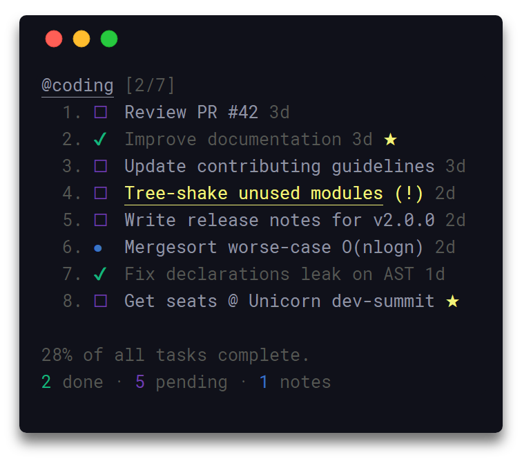
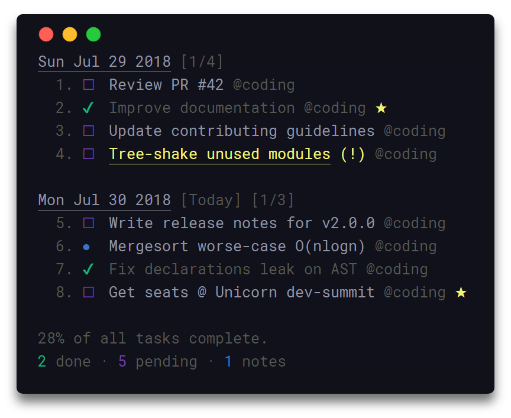

# taskbook [![explain]][source] [![translate-svg]][translate-list]

[explain]: http://llever.com/explain.svg
[source]: https://github.com/chinanf-boy/Source-Explain
[translate-svg]: http://llever.com/translate.svg
[translate-list]: https://github.com/chinanf-boy/chinese-translate-list

「 📓命令行的任务，板块 和 笔记 」

[更多其他中文翻译](https://github.com/chinanf-boy/chinese-translate-list)

---

### 原文 commit / 日期

- `commit` https://github.com/klauscfhq/taskbook/tree/9cc92e81040b4995ed09ded463217c6145b9280e
- ⏰ 2018 7.31

### 贡献

欢迎 👏 勘误/校对/更新贡献 😊 [具体贡献请看](https://github.com/chinanf-boy/chinese-translate-list#贡献)

## 生活

[help me live , live need money 💰](https://github.com/chinanf-boy/live-need-money)

---


<h1 align="center">
  Taskbook
</h1>

<h4 align="center">
  📓 任务，板块 和 笔记 都在 命令行这个栖息地
</h4>

<div align="center">
  
</div>

<p align="center">
  <a href="https://travis-ci.com/klauscfhq/taskbook">
    
  </a>
</p>

### 目录

<!-- START doctoc generated TOC please keep comment here to allow auto update -->
<!-- DON'T EDIT THIS SECTION, INSTEAD RE-RUN doctoc TO UPDATE -->


- [描述](#%E6%8F%8F%E8%BF%B0)
- [强调](#%E5%BC%BA%E8%B0%83)
- [安装](#%E5%AE%89%E8%A3%85)
- [用法](#%E7%94%A8%E6%B3%95)
- [查看](#%E6%9F%A5%E7%9C%8B)
  - [板块视图](#%E6%9D%BF%E5%9D%97%E8%A7%86%E5%9B%BE)
  - [时间线视图](#%E6%97%B6%E9%97%B4%E7%BA%BF%E8%A7%86%E5%9B%BE)
- [配置](#%E9%85%8D%E7%BD%AE)
  - [详细](#%E8%AF%A6%E7%BB%86)
      - [`taskbookDirectory`](#taskbookdirectory)
      - [`displayCompleteTasks`](#displaycompletetasks)
      - [`displayProgressOverview`](#displayprogressoverview)
- [飞行手册](#%E9%A3%9E%E8%A1%8C%E6%89%8B%E5%86%8C)
  - [创建任务](#%E5%88%9B%E5%BB%BA%E4%BB%BB%E5%8A%A1)
  - [创建笔记](#%E5%88%9B%E5%BB%BA%E7%AC%94%E8%AE%B0)
  - [创建板块](#%E5%88%9B%E5%BB%BA%E6%9D%BF%E5%9D%97)
  - [完成任务](#%E5%AE%8C%E6%88%90%E4%BB%BB%E5%8A%A1)
  - [收藏物品](#%E6%94%B6%E8%97%8F%E7%89%A9%E5%93%81)
  - [显示板块](#%E6%98%BE%E7%A4%BA%E6%9D%BF%E5%9D%97)
  - [显示时间轴](#%E6%98%BE%E7%A4%BA%E6%97%B6%E9%97%B4%E8%BD%B4)
  - [设置优先级](#%E8%AE%BE%E7%BD%AE%E4%BC%98%E5%85%88%E7%BA%A7)
  - [移动项目](#%E7%A7%BB%E5%8A%A8%E9%A1%B9%E7%9B%AE)
  - [删除项目](#%E5%88%A0%E9%99%A4%E9%A1%B9%E7%9B%AE)
  - [显示档案](#%E6%98%BE%E7%A4%BA%E6%A1%A3%E6%A1%88)
  - [还原项目](#%E8%BF%98%E5%8E%9F%E9%A1%B9%E7%9B%AE)
  - [列出项目](#%E5%88%97%E5%87%BA%E9%A1%B9%E7%9B%AE)
  - [搜索项目](#%E6%90%9C%E7%B4%A2%E9%A1%B9%E7%9B%AE)
- [发展](#%E5%8F%91%E5%B1%95)
- [有关](#%E6%9C%89%E5%85%B3)
- [团队](#%E5%9B%A2%E9%98%9F)
- [执照](#%E6%89%A7%E7%85%A7)

<!-- END doctoc generated TOC please keep comment here to allow auto update -->

## 描述

通过使用 简单且最小化 的使用语法,平坦的学习曲线,使您可以在终端内 跨多个板块,有效地管理任务和笔记. 所有数据都以原子方式写入存储,以防止损坏,并且永远不会与任何第三方实体共享. 已删除的项目会自动存档,并且可以随时完成或恢复. 

访问[贡献指南](https://github.com/klauscfhq/taskbook/blob/master/contributing.md#translating-documentation)了解有关如何将此文档翻译成更多语言的更多信息. 

来[Gitter](https://gitter.im/klauscfhq/taskbook)要么[推特](https://twitter.com/klauscfhq)分享您对项目的看法. 

## 强调

-   组织 任务和笔记 到板块
-   板块 和 时间表视图
-   优先和喜爱的机制
-   搜索和过滤项目
-   存档并恢复已删除的项目
-   轻巧快速
-   数据以原子方式写入存储
-   自定义存储位置
-   进展概述
-   简单和最小的使用语法
-   更新通知
-   可配置通过`~/.taskbook.json`
-   数据存储在JSON文件中`~/.taskbook/storage`

查看强调特性[taskbook 黑板报](https://raw.githubusercontent.com/klauscfhq/taskbook/master/media/highlights.png). 

## 安装

```bash
npm install --global taskbook
```

## 用法

    $ tb --help

      Usage
        $ tb [<options> ...]

        Options
            none             显示板块视图
          --task, -t         创建任务
          --note, -n         创建笔记
          --timeline, -i     显示时间线视图
          --delete, -d       删除项目
          --check, -c        选中/取消选中任务
          --star, -s         Star/unstar 项目
          --list, -l         按属性列出项目
          --find, -f         搜索商品
          --edit, -t         编辑项目描述
          --move, -m         在板块之间移动物品
          --priority, -p     更新任务的优先级
          --archive, -a      显示已归档的项目
          --restore, -r      从存档还原项目
          --help, -h         显示帮助信息
          --version, -v      显示已安装的版本

        Examples
          $ tb
          $ tb --task Make some buttercream
          $ tb --task @coding Improve documentation
          $ tb --task @coding @reviews Review PR #42
          $ tb --note @coding Mergesort worse-case O(nlogn)
          $ tb --check 1 2
          $ tb --delete 4
          $ tb --star 2
          $ tb --priority @3 2
          $ tb --timeline
          $ tb --edit @3 Merge PR #42
          $ tb --move @1 cooking
          $ tb --find documentation
          $ tb --list pending coding
          $ tb --archive
          $ tb --restore 4

## 查看

### 板块视图

在没有任何选项的情况下调用 taskbook ,将显示分组到各自板中的所有已保存项目. 

<div align="center">
  
</div>

### 时间线视图

为了显示时间线视图中的所有项目,根据其创建日期,`--timeline`/`-i`选项可以使用. 

<div align="center">
  
</div>

## 配置

要配置 taskbook 导航到`~/.taskbook.json`并修改任何选项以符合您自己的偏好. 要重置回默认值,只需从主目录中删除配置文件即可. 

以下说明了所有可用选项及其各自的默认值. 

```json
{
  "taskbookDirectory": "",
  "displayCompleteTasks": true,
  "displayProgressOverview": true
}
```

### 详细

##### `taskbookDirectory`

-   类型: `String`
-   默认: `~`

初始化存储完成文件的系统路径,即;`/home/username/the-cloud`

如果未定义,将设置`~/.taskbook/`. 

##### `displayCompleteTasks`

-   类型: `Boolean`
-   默认: `true`

显示标记为完成的任务. 

##### `displayProgressOverview`

-   类型: `Boolean`
-   默认: `true`

在时间线和电路板视图下方显示进度概述. 

## 飞行手册

以下是一个小练习,其中包含一组有关如何使用 taskbook 的示例. 如果您发现错误或认为某个示例不够清晰并且应该进一步改进,请随时打开[问题](https://github.com/klauscfhq/taskbook/issues/new/choose)要么[Pull 请求](https://github.com/klauscfhq/taskbook/compare). 

### 创建任务

要创建新任务,请使用`--task`/`-t`紧随其后的任务说明选项. 

    $ tb -t Improve documentation

### 创建笔记

要创建新笔记,请使用`--note`/`-n`紧跟着你的笔记正文的选项. 

    $ tb -n Mergesort worse-case O(nlogn)

### 创建板块

创建新任务或笔记时,会自动初始化板块. 要创建一个或多个板块,请包含其名称,前缀为`@`符号,在即将创建的项目的描述中. 因此,新创建的项目将属于所有给定的板块. 默认情况下,描述中不包含任何板块名称的项目会自动添加到通用的;`My Board`. 

    $ tb -t @coding @docs Update contributing guidelines

### 完成任务

要将任务标记为 完成/未完成,请使用`--check`/`-c`选项后跟目标任务的ID. 请注意,该选项将 `switch-开关` 给定任务的`complete`状态,因此 完成任务 -> `-c` -> 待处理状态,待处理任务 -> `-c` -> 完成. 重复的ID会自动过滤掉. 

    $ tb -c 1 3

### 收藏物品

要将一个或多个项目标记为收藏,请使用`--star`/`-s`选项后跟目标项的ID. 该选项的功能与上述功能相同`--check`选项. 

    $ tb -s 1 2 3

### 显示板块

在没有任何选项的情况下调用 taskbook 将显示分组到各自板中的所有已保存项目. 

    $ tb

### 显示时间轴

为了显示时间线视图中的所有项目,根据其创建日期,`--timeline`/`-i`选项可以使用. 

    $ tb -i

### 设置优先级

要在初始化任务时设置任务的优先级,请包括`p:x`任务描述中的语法,其中x可以是值的整数`1`,`2`要么`3`. 请注意,默认情况下,所有任务都以正常优先级-`1`创建. 

-   `1`- 正常优先
-   `2`- 中等优先级
-   `3`- 高度优先


    $ tb -t @coding Fix issue `#42` p:3

要在创建特定任务后更新特定任务的优先级,请使用`--priority`/`-p`选项以及 `id 目标任务, id` 是以前缀`@`符号和值的整数`1`,`2`要么`3`. 请注意,目标ID和优先级的放置顺序 并不重要. 

    $ tb -p @1 2

### 移动项目

要将项目移动到一个或多个板块,请使用`--move`/`-m`选项,后跟`目标ID,id` 是以前缀为`@`符号和目标板块的名称. 默认值`My board`可以通过访问`myboard`关键词. 目标ID和电路板名称的放置顺序并不重要. 

    $ tb -m @1 myboard reviews

### 删除项目

要删除一个或多个项目,请使用`--delete`/`-d`选项后跟目标项的ID. 请注意,已删除的项目会自动存档,并且可以随时完成或还原. 重复的ID会自动过滤掉. 

    $ tb -d 1 2

### 显示档案

要显示所有已存档项目,请使用`--archive`/`-a`选项. 请注意,所有已存档项目都会根据其创建日期显示在时间轴视图中. 

    $ tb -a

### 还原项目

要恢复一个或多个项目,请使用`--restore`/`-r`选项后跟目标项的ID. 请注意,调用时可以看到所有已存档项目的ID`--archive`/`-a`选项. 重复的ID会自动过滤掉. 

    $ tb -r 1 2

### 列出项目

要列出一组项目,其中每个项目符合特定数量的属性,请使用`--list`/`-l`选项后跟所需的属性. 板块名称和项目特征 可以被视为有效的列表属性. 例如,列出属于默认值的所有项目`myboard`并且是 待定任务,可以使用以下内容;

    $ tb -l myboard pending

默认支持的列表属性及其各自的别名如下: 

-   `myboard`- 属于的项目`My board`
-   `task`,`tasks`,`todo`- 作为任务的项目. 
-   `note`,`notes`- 作为笔记的项目. 
-   `pending`,`unchecked`,`incomplete`- 待处理任务的项目. 
-   `done`,`checked`,`complete`- 完成任务的项目. 
-   `star`,`starred`- 已加星标的项目. 

### 搜索项目

要搜索其中一个项目,请使用`--find`/`-f`选项,后跟您的搜索字词. 

    $ tb -f documentation

## 发展

有关如何为项目做出贡献的更多信息,请阅读[贡献指南](https://github.com/klauscfhq/taskbook/blob/master/contributing.md). 

-   Fork 存储库并将其克隆到您的计算机
-   导航到您的本地 Fork: `cd taskbook`
-   安装项目依赖项: `npm install`要么`yarn install`
-   测试错误代码: `npm test`要么`yarn test`

## 有关

-   [chalk](https://github.com/chalk/chalk)- 终端字符串样式,干的好
-   [signale](https://github.com/klauscfhq/signale)-  可自制的控制台记录器

## 团队

-   Klaus Sinani[ (@klauscfhq) ](https://github.com/klauscfhq)

## 执照

[MIT](https://github.com/klauscfhq/taskbook/blob/master/license.md)
